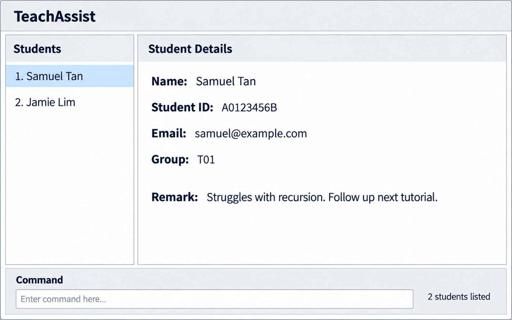

# TeachAssist

[](https://github.com/AY2627S1-CS2103T-F12-1/tp/actions)



## About TeachAssist

TeachAssist is a desktop application that helps Teaching Assistants manage information about the students under their care.

Teaching Assistants often need to recall students' names, tutorial groups, learning difficulties, previous interactions, and matters requiring follow-up. TeachAssist keeps this information in one place so that TAs can retrieve and update it quickly while preparing for tutorials or consultations.

TeachAssist is designed for users who prefer a fast, keyboard-driven command-line interface while still benefiting from a graphical overview of their student records.

## Target users

TeachAssist is intended for Teaching Assistants who:

* support one or more fixed groups of students throughout a semester
* conduct tutorials or consultations regularly
* need to retrieve student information quickly
* want to keep track of learning difficulties and follow-up matters

## Main features

TeachAssist allows users to:

* add and remove student records
* view all students and their information
* find students by name, student ID, or email
* record additional information as free-text remarks
* assign tutorial-group labels to students
* filter students according to their tutorial groups
* save student records automatically between sessions

Remarks can be used to record information such as learning difficulties, consultation details, assessment progress, or intended follow-up actions.

## Example commands

Add a student:

```text
add n/Samuel Tan i/A0123456B e/samuel@example.com r/Struggles with recursion
```

Find a student:

```text
find n/Samuel
```

Assign a tutorial-group label:

```text
label l/Tutorial T01 i/A0123456B
```

Display students from a tutorial group:

```text
filter l/Tutorial T01
```

Display the complete student list:

```text
list
```

## Project scope

TeachAssist focuses on organising student records for a TA's personal teaching workflow.

It is not intended to replace a Learning Management System for distributing course materials, conducting assessments, calculating official grades, or communicating directly with students.

## Documentation

* [User Guide](docs/UserGuide.md)
* [Developer Guide](docs/DeveloperGuide.md)
* [About Us](docs/AboutUs.md)

## Acknowledgements

TeachAssist is based on the [AddressBook Level 3](https://se-education.org/addressbook-level3/) project created by the [SE-EDU initiative](https://se-education.org).
