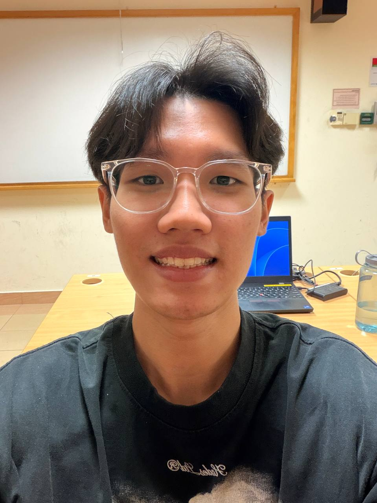
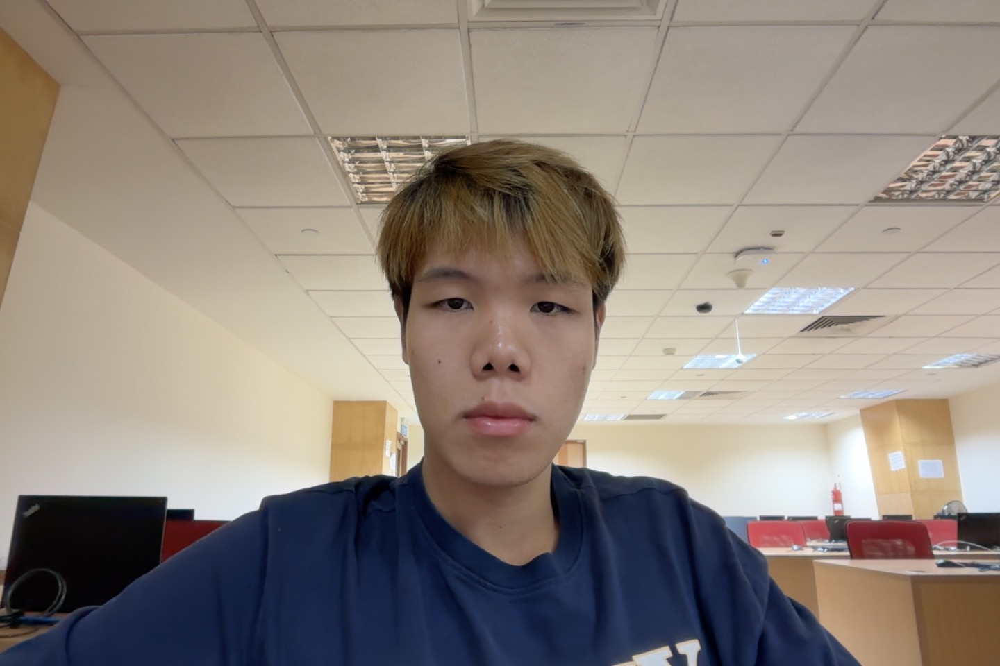
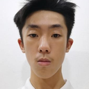
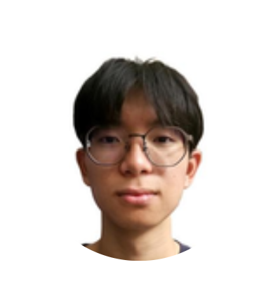

# About Us

We are a team based in the [School of Computing, National University of Singapore](http://www.comp.nus.edu.sg).

You can reach us at the email `seer[at]comp.nus.edu.sg`

## Project team

### Samuel Lau 

[[github](https://github.com/sammeowwww)]
[[portfolio](team/sammeowwww.md)]

* Role: Project Advisor

### Ananya Kharbanda

[[github](http://github.com/ananyakharbanda)]
[[portfolio](team/ananyakharbanda.md)]

* Role: Developer 
* Responsibilities: Dev Ops + Threading

### Bryan Lee Jun You

[[github](http://github.com/8ryanl33)] [[portfolio](team/8ryanl33.md)]

* Role: Developer
* Responsibilities: Data

### Gou Guan Lin

[[github](http://github.com/amberrrruby)]
[[portfolio](team/amberrrruby.md)]

* Role: Developer
* Responsibilities: *(to be added)*

### Tristan Tay

[[github](http://github.com/DaRealTristan)]
[[portfolio](team/darealtristan.md)]

* Role: Code Quality
* Responsibilities: Storage
